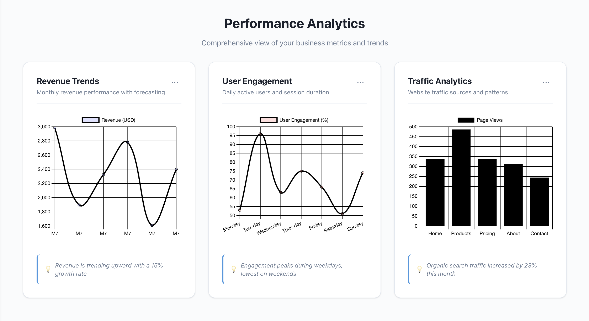

# 📊 ADmyBRAND Insights – React Dashboard
<p align="center">
  
</p>

<p align="center">
  
  
  
  
</p>

A sleek, responsive analytics dashboard rebuilt with React + Vite. It mirrors the original UI while adding a componentized architecture, a theme context, and react-chartjs-2 powered charts.

---

## 🚀 Preview

<a href="https://yxshdogra-analyticsdashboard.vercel.app/"><strong>Live</strong></a>

<p align="center">
  
</p>


---

## ✨ Features

* Interactive charts: revenue, engagement, and traffic (Chart.js via react-chartjs-2)
* KPI cards with simulated real-time updates
* Sort/filter/paginate table + CSV export
* Light/Dark theme with `ThemeContext`
* Responsive layout and modern CSS variables

---

## 🛠️ Tech Stack

* React + Vite
* Chart.js v4 with react-chartjs-2
* CSS modules-by-file (plain CSS per component) and CSS variables

---

## 📦 Project Structure

The React app lives in the `code/` directory.

```
code/
├── index.html
├── package.json
├── vite.config.js
└── src/
    ├── main.jsx
    ├── App.jsx
    ├── contexts/ThemeContext.jsx
    ├── components/
    │   ├── Sidebar.jsx, Header.jsx, Dashboard.jsx, Analytics.jsx, Reports.jsx, Settings.jsx
    │   ├── DataTable.jsx, ChartCard.jsx
    │   └── charts/RevenueChart.jsx, EngagementChart.jsx, TrafficChart.jsx, TrafficSourcesPieChart.jsx
    └── styles (co-located .css files)
```

---

## 🧑‍� Getting Started

Requires Node.js 18+.

```sh
git clone https://github.com/yxshee/admybrand-dashboard.git
cd admybrand-dashboard/code
npm install
npm run dev
```

The app runs at http://localhost:5173 by default.

### Build & Preview

```sh
cd code
npm run build
npm run preview
```

---

## ⚙️ How It Works

* `App.jsx` wires the layout with `Sidebar`, `Header`, and route-like tab switching.
* `ThemeContext.jsx` controls dark/light mode by toggling a class on `body`.
* Charts use `react-chartjs-2` with theme-aware colors via CSS variables.
* `DataTable.jsx` implements client-side search, sort, pagination, and CSV export.

---

## 🌐 Deployment

Ready for Vercel deployment with included `vercel.json` configuration:

[](https://vercel.com/new/clone?repository-url=https://github.com/yxshee/admybrand-dashboard)

### Manual Steps:
1. Connect GitHub repo to Vercel
2. Vercel auto-detects settings from `vercel.json`
3. Deploy automatically on push to main

See `DEPLOYMENT.md` for detailed instructions.

---

## 🤝 Contributing

1. Fork the repo and create a feature branch
2. Work in `code/`
3. Run `npm run lint` and `npm run build`
4. Open a PR

---

## 📜 License

Public domain under CC0-1.0. See `LICENSE` for details.

---

## 🙏 Acknowledgements

* React, Vite, Chart.js, and react-chartjs-2
* Shields.io for badges
